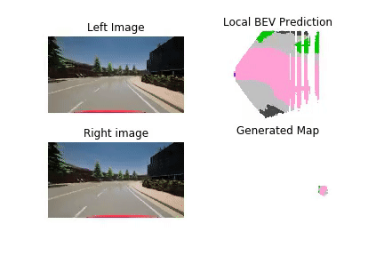

# SBEVNet: End-to-End Deep Stereo Bird's Eye View Layout Estimation

This repository contains the code for "SBEVNet: End-to-End Deep Stereo Layout Estimation" paper by Divam Gupta, Wei Pu, Trenton Tabor, Jeff Schneider




## Usage


### Dependencies
```bash
pip install --upgrade git+https://github.com/divamgupta/pytorch-propane
pip install torch==1.4.0 torchvision==0.5.0
pip install opencv-python
pip install torchgeometry
```

### Dataset and Directories
For the example we use the following directories:
* Datasets : ./datasets/carla/ and ./datasets/kitti/
* Weights :  ./sbevnet_weights/carla and ./sbevnet_weights/kitti 
* Predictions :  ./predictions/kitti ./predictions/carla 

Download and unzip the datasets and place them in ./datasets directory 
* CARLA dataset: https://drive.google.com/file/d/1Ow1cfISLqYKxid-XPGuBvBlE4zjldjZ0/view?usp=sharing
* KITTI dataset: https://drive.google.com/file/d/1kvcBtS2fSN4MFBnbQ7qPsWNdIotgqECy/view?usp=sharing 
* Trained models: https://drive.google.com/file/d/1Y2aICr7pr0AjwSmMqMTWf8PkhoSA14Zu/view?usp=sharing 


### Training

```bash
cd <cloned_repo_path>
```

Training the model on the CARLA dataset:
```bash
pytorch_propane sbevnet train    \
 --model_name sbevnet_model --network_name sbevnet --dataset_name  sbevnet_dataset_main --dataset_split train \
 --eval_dataset_name "sbevnet_dataset_main" --eval_dataset_split test \
 --batch_size 3  --eval_batch_size 1 \
 --n_epochs 20   --overwrite_epochs true  \
 --datapath "datasets/carla/dataset.json" \
 --save_path "sbevnet_weights/carla/carla_save_0" \
 --image_w 512 \
 --image_h 288 \
 --max_disp 64 \
 --n_hmap 100 \
 --xmin 1 \
 --xmax 39 \
 --ymin -19 \
 --ymax 19 \
 --cx 256 \
 --cy 144 \
 --f 179.2531 \
 --tx 0.2 \
 --camera_ext_x 0.9 \
 --camera_ext_y -0.1 \
 --fixed_cam_confs true \
 --do_ipm_rgb true \
 --do_ipm_feats true  \
 --do_mask true --check_degenerate true 
```


Training the model on the KITTI dataset:
```bash
pytorch_propane sbevnet train    \
 --model_name sbevnet_model --network_name sbevnet --dataset_name  sbevnet_dataset_main --dataset_split train \
 --eval_dataset_name "sbevnet_dataset_main" --eval_dataset_split test \
 --batch_size 3  --eval_batch_size 1 \
 --n_epochs 40   --overwrite_epochs true  \
 --datapath "datasets/kitti/dataset.json" \
 --save_path "sbevnet_weights/kitti/kitti_save_0" \
 --image_w 640 \
 --image_h 256 \
 --max_disp 64 \
 --n_hmap 128 \
 --xmin 5.72 \
 --xmax 43.73 \
 --ymin -19 \
 --ymax 19 \
 --camera_ext_x 0 \
 --camera_ext_y 0 \
 --fixed_cam_confs false \
 --do_ipm_rgb true \
 --do_ipm_feats true  \
 --do_mask true --check_degenerate true 
 ```

### Evaluation
Evaluating the model on the CARLA dataset:
```bash
pytorch_propane sbevnet eval_iou    \
 --model_name sbevnet_model --network_name sbevnet \
 --eval_dataset_name "sbevnet_dataset_main" --eval_dataset_split test --dataset_type carla \
 --eval_batch_size 1 \
 --datapath "datasets/carla/dataset.json" \
 --load_checkpoint_path "sbevnet_weights/carla/carla_save_0" \
 --image_w 512 \
 --image_h 288 \
 --max_disp 64 \
 --n_hmap 100 \
 --xmin 1 \
 --xmax 39 \
 --ymin -19 \
 --ymax 19 \
 --cx 256 \
 --cy 144 \
 --f 179.2531 \
 --tx 0.2 \
 --camera_ext_x 0.9 \
 --camera_ext_y -0.1 \
 --fixed_cam_confs true \
 --do_ipm_rgb true \
 --do_ipm_feats true  \
 --do_mask true 
```


Evaluating the model on the KITTI dataset:
```bash
pytorch_propane sbevnet eval_iou    \
 --model_name sbevnet_model --network_name sbevnet  \
 --eval_dataset_name "sbevnet_dataset_main" --eval_dataset_split test --dataset_type kitti \
 --eval_batch_size 1 \
 --datapath "datasets/kitti/dataset.json" \
 --load_checkpoint_path "sbevnet_weights/kitti/kitti_save_0" \
 --image_w 640 \
 --image_h 256 \
 --max_disp 64 \
 --n_hmap 128 \
 --xmin 5.72 \
 --xmax 43.73 \
 --ymin -19 \
 --ymax 19 \
 --camera_ext_x 0 \
 --camera_ext_y 0 \
 --fixed_cam_confs false \
 --do_ipm_rgb true \
 --do_ipm_feats true  \
 --do_mask true 
```

### Save Predictions
Save predictions of the model on the CARLA dataset:
```bash
pytorch_propane sbevnet save_preds    \
 --model_name sbevnet_model --network_name sbevnet \
 --eval_dataset_name "sbevnet_dataset_main" --eval_dataset_split test --output_dir "predictions/kitti" \
 --eval_batch_size 1 \
 --datapath "datasets/carla/dataset.json" \
 --load_checkpoint_path "sbevnet_weights/carla/carla_save_0" \
 --image_w 512 \
 --image_h 288 \
 --max_disp 64 \
 --n_hmap 100 \
 --xmin 1 \
 --xmax 39 \
 --ymin -19 \
 --ymax 19 \
 --cx 256 \
 --cy 144 \
 --f 179.2531 \
 --tx 0.2 \
 --camera_ext_x 0.9 \
 --camera_ext_y -0.1 \
 --fixed_cam_confs true \
 --do_ipm_rgb true \
 --do_ipm_feats true  \
 --do_mask true 
```


Save predictions of the model on the KITTI dataset:
```bash
pytorch_propane sbevnet save_preds    \
 --model_name sbevnet_model --network_name sbevnet  \
 --eval_dataset_name "sbevnet_dataset_main" --eval_dataset_split test --output_dir "predictions/kitti" \
 --eval_batch_size 1 \
 --datapath "datasets/kitti/dataset.json" \
 --load_checkpoint_path "sbevnet_weights/kitti/kitti_save_0" \
 --image_w 640 \
 --image_h 256 \
 --max_disp 64 \
 --n_hmap 128 \
 --xmin 5.72 \
 --xmax 43.73 \
 --ymin -19 \
 --ymax 19 \
 --camera_ext_x 0 \
 --camera_ext_y 0 \
 --fixed_cam_confs false \
 --do_ipm_rgb true \
 --do_ipm_feats true  \
 --do_mask true 
```


